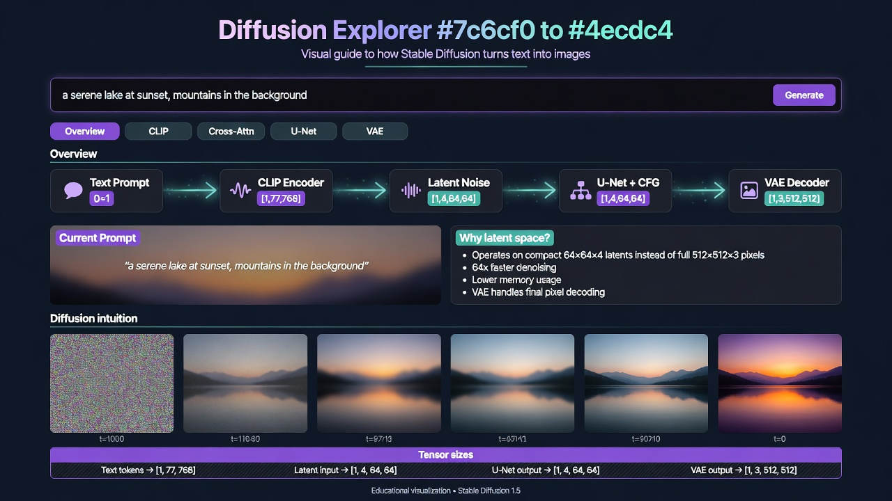
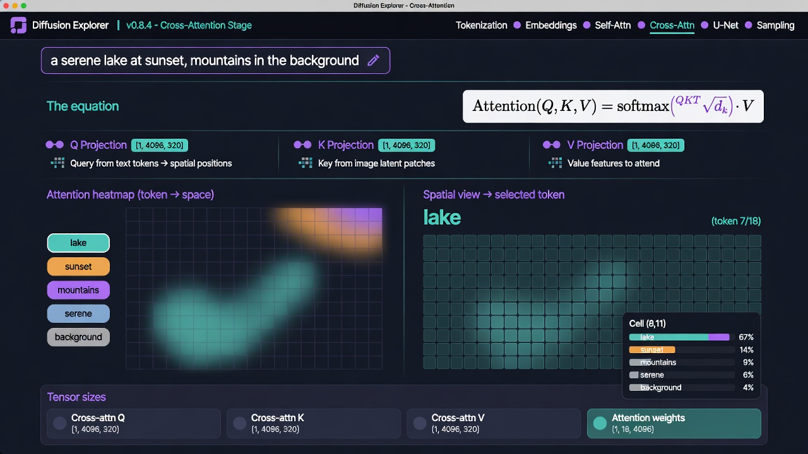
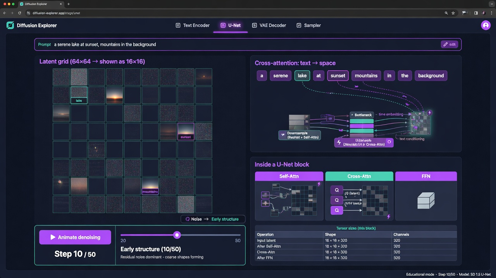
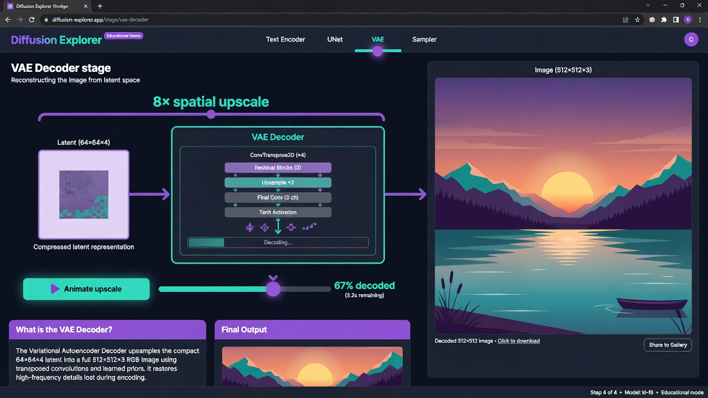

# Diffusion Explorer

> An interactive web app that helps you understand diffusion models and the Stable Diffusion pipeline intuitively.

**Diffusion Explorer** is a browser-based educational tool that makes the inner workings of latent diffusion models (such as Stable Diffusion) tangible through live, interactive visualizations.

Type any prompt and instantly see how it flows through text encoding, cross-attention, iterative denoising in latent space, and final decoding — all without running a real neural network.

## Screenshots

Screenshots of the main stages using the default prompt ("a serene lake at sunset, mountains in the background"):

### Overview



### Cross-Attention



### U-Net Denoising



### VAE Decoder



## What It Demonstrates

The app decomposes a typical text-to-image latent diffusion pipeline into five explorable stages:

- **Overview** — End-to-end flow, why latent space exists, and the intuition behind the forward (noising) and reverse (denoising) processes.
- **CLIP** — Tokenization of the prompt into sub-word tokens, embedding lookup, and construction of the `[1, 77, 768]` text context tensor.
- **Cross-Attention** — The critical mechanism where spatial queries from the latent attend to text keys/values. Includes an interactive heatmap and per-cell token competition view.
- **U-Net** — Step-wise denoising of the 64×64×4 latent, with visual highlighting of which regions are being "steered" by specific tokens at each timestep.
- **VAE** — The 8× upscaling process that turns the final denoised latent into a 512×512 RGB image.

## Key Interactive Features

- **Live prompt** — The input field at the top drives every visualization in real time.
- **Token selection & spatial heatmaps** (Cross-Attention) — Click a token to see its attention distribution across the (downsampled) image grid. Hover cells to see the mix of tokens competing for that location.
- **Denoising timeline** (U-Net) — Slider + "Animate denoising" button that walks through representative timesteps while updating the latent grid and attended regions.
- **Upscale animation** (VAE) — Watch a stylized scene "decode" with a progress-controlled scale and overlay effect.
- **Tensor Size Panels** — Every stage includes a reference table showing representative tensor names, shapes (e.g. `[1, 4, 64, 64]`, `[1, 4096, 77]`, `[1, 3, 512, 512]`), dtypes, and element counts.
- **Attention heuristics** — Spatial influence is derived from simple keyword-based priors (e.g. "lake", "mountain", "sunset") combined with softmax normalization. This produces semantically plausible behavior for the default prompt without any model weights.

## Getting Started

```bash
# 1. Install dependencies
npm install

# 2. Start the development server
npm run dev
```

Open **http://localhost:5173** in your browser.

### Available Scripts

| Script           | Description                                      |
|------------------|--------------------------------------------------|
| `npm run dev`    | Start Vite dev server with HMR                   |
| `npm run build`  | Type-check with `tsc` then produce production build |
| `npm run preview`| Serve the production build locally               |
| `npm run lint`   | Run ESLint                                       |

## Tech Stack

- **React 19** + **TypeScript** (strict)
- **Vite 8** (Oxc-based React plugin)
- Vanilla **CSS** (extensive use of CSS custom properties for theming)
- Zero heavy runtime dependencies beyond React and React DOM
- All visualizations are hand-crafted SVG/CSS/React components (no canvas/WebGL or external charting libs)

## Project Structure

```
grok-build-test/
├── src/
│   ├── App.tsx                 # Prompt state + stage navigation
│   ├── main.tsx
│   ├── App.css                 # Global layout, cards, buttons, sliders
│   ├── index.css               # CSS variables, base styles, scrollbars
│   ├── data/
│   │   └── pipeline.ts         # Tokenization, attention simulation logic,
│   │                           # DENOISE_STEPS, PIPELINE_TENSORS catalog,
│   │                           # getAttentionWeights / getAttentionMap
│   └── components/
│       ├── OverviewStage.tsx
│       ├── ClipStage.tsx
│       ├── CrossAttentionStage.tsx   # Q/K/V cards, heatmaps, spatial view
│       ├── UnetStage.tsx             # Latent grid + timestep animation
│       ├── VaeStage.tsx              # Decoding progress + scene illustration
│       ├── TensorSizePanel.tsx       # Reusable tensor reference (table or chips)
│       └── stages.css                # Stage-specific styling
├── public/
├── dist/                           # Production build output
├── package.json
├── vite.config.ts
└── tsconfig*.json
```

## Important Educational Notes

This project prioritizes **intuition over accuracy**:

- The tokenizer is a simplified BPE-style splitter, not the real CLIP BPE vocabulary.
- Attention scores are generated by a heuristic function (`cellWeight`) rather than actual learned Q, K, V projections and `softmax(QK^T / √d)`.
- All spatial grids are heavily downsampled proxies of the true 64×64 latent resolution for performance and clarity.
- The final "image" in the VAE stage is a hand-coded CSS illustration (sky, sun, mountains, lake) that matches the default prompt — it does not come from any decoder.
- Tensor dimensions are realistic for Stable Diffusion 1.x but are shown for pedagogical purposes only.

The aim is to help people *feel* how text conditioning reaches every pixel, why operating in latent space is powerful, and how progressive refinement works — concepts that are often difficult to internalize from static diagrams or equations alone.

## License

MIT

---

*Created as an experiment in interactive technical education.*
